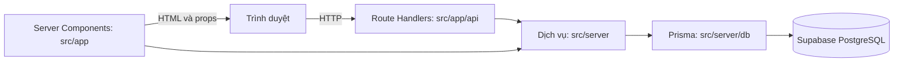

# Kiến trúc T'Petie

## Mô hình triển khai

Đây là ứng dụng **Next.js full stack trong một repo**. `npm run dev` khởi động cả giao diện lẫn backend HTTP của Next.js. Backend không phải tiến trình độc lập; khi triển khai trên Vercel, các Route Handler và Server Component chạy phía máy chủ. PostgreSQL của Supabase chỉ được truy cập từ máy chủ bằng Prisma.

## Quy tắc thư mục

| Vị trí | Trách nhiệm | Có được truy cập DB? |
| --- | --- | --- |
| `src/app/api` | HTTP API, xác thực, kiểm tra dữ liệu, mã trạng thái | Qua `src/server` hoặc Prisma cho truy vấn quản trị đơn giản |
| `src/app` trang không có `'use client'` | Server Components, kết hợp dữ liệu và giao diện | Qua `src/server` |
| `src/server` | Truy vấn, nghiệp vụ, giao dịch, xác thực, giới hạn lượt thử | Có |
| `src/components`, `src/context`, `src/hooks`, `src/client` | UI và trạng thái trình duyệt | Không |
| `src/lib` | Hàm thuần, hằng số và định dạng dùng chung | Không |
| `prisma` | Schema, migration, seed | Chạy bởi Prisma CLI phía máy chủ |

Mã trong `src/server` dùng `server-only` ở các entrypoint truy cập DB. Kiểm tra kiến trúc trong `tests/architecture-boundary.test.mjs` chặn import `src/server` hoặc Prisma từ file có `'use client'` và từ các thư mục client. `CONNECTION_STRING` chỉ nằm trong `.env`/`.env.local` bị Git bỏ qua; không tạo biến `NEXT_PUBLIC_` cho chuỗi kết nối.

## Ví dụ luồng đặt hàng

1. Giao diện gọi `POST /api/quote` và `POST /api/checkout`.
2. Route Handler kiểm tra đầu vào, phiên đăng nhập và giới hạn lượt thử.
3. `src/server/orders` đọc giá, tồn kho, chính sách vận chuyển và coupon từ DB. Tạo đơn và trừ tồn kho trong transaction.
4. API chỉ trả dữ liệu cần hiển thị; trình duyệt không quyết định tổng tiền cuối cùng.

## Phạm vi hiện tại

Giỏ hàng lưu trong trình duyệt, nhưng khi báo giá và đặt đơn backend đọc lại DB. Bản cũ nằm trong `archive/legacy-site` để đối chiếu; ứng dụng mới không import mã hoặc dữ liệu runtime từ đó. Các phần nghiệp vụ chưa hoàn chỉnh được liệt kê trong `CAN_BAN_BO_SUNG.md`.

Catalog, bộ sưu tập, feedback, bảng size và slide giới thiệu có nguồn chạy từ PostgreSQL. Bảng `site_content` giữ hai tài liệu nội dung nhỏ (`size_guide`, `home_features`), được kiểm tra cấu trúc trước khi trả ra giao diện. File ảnh trong `public/images` là tài sản tĩnh; DB lưu URL trỏ tới ảnh, nên các ảnh đang được tham chiếu phải tiếp tục có trong bản triển khai. [Danh sách ảnh còn dùng](image-inventory.md) ghi rõ nguồn UI hoặc DB của từng file. Repo không còn JSON catalog hoặc script nạp lại dữ liệu kinh doanh mẫu.
