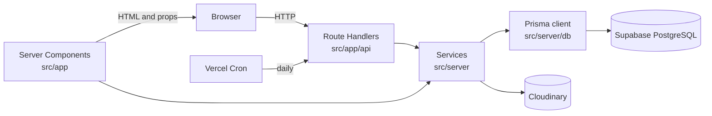

# Architecture

This document describes the current implementation. Start with the [project README](../README.md) for setup and the documentation index. Historical designs in `docs/reference/` may differ from the running application.

## Runtime model

T'Petie is a single Next.js 14 App Router application. `npm run dev` serves both the UI and the HTTP API; there is no separate backend process. On Vercel, Server Components and Route Handlers run as Vercel Functions in the `icn1` region. PostgreSQL (Supabase) is reached only from server code, through Prisma.

## Directory responsibilities

| Location | Responsibility | Database access |
| --- | --- | --- |
| `src/app/api` | HTTP API: authentication, input validation, status codes | Yes, through `src/server` services or the shared Prisma client |
| `src/app` (files without `'use client'`) | Server Components that load data and render pages | Yes, through `src/server` |
| `src/server` | Queries, business rules, transactions, authentication, rate limiting, Cloudinary | Yes |
| `src/middleware.ts` | Role-based redirects, decided from the session token alone | No |
| `src/components`, `src/context`, `src/hooks`, `src/client` | UI and browser state | No |
| `src/lib` | Pure functions, constants, validation and formatting shared by client and server | No |
| `prisma` | Schema and migrations | Prisma CLI only |

The shared Prisma client is created in `src/server/db/client.ts`. It picks connection-pool settings for the environment (long-running server, build or serverless) through `src/lib/db/connection-url.ts`; see [deploy-vercel.md](deploy-vercel.md#7-operations-notes).

## Boundaries enforced by tests

`tests/architecture-boundary.test.mjs` (part of `npm test`) enforces two rules:

- Files in `src/client`, `src/components`, `src/context` and `src/hooks`, and every `src/app` file that starts with `'use client'`, must not import `@/server/...` or `@prisma/client`, and must not read `process.env.CONNECTION_STRING`.
- The database entry points in `src/server` (Prisma client, raw SQL helper, authentication, catalog queries, orders, reviews, rate limiting) must start with `import 'server-only'`.

Connection strings must never be exposed through `NEXT_PUBLIC_` variables. `npm run env:check` and the Vercel build reject `NEXT_PUBLIC_` variables whose names contain `SECRET`, `PASSWORD`, `PRIVATE`, `API_KEY` or `TOKEN`.

## Authentication and roles

- NextAuth.js 4 with JWT sessions (7 days) and the Prisma adapter (`src/server/auth/options.ts`).
- Credentials sign-in accepts an email or a username with a bcrypt-hashed password. Attempts are rate limited per account and IP, and per IP.
- Google sign-in is optional (registered only when `GOOGLE_CLIENT_ID` and `GOOGLE_CLIENT_SECRET` are set) and accepts only emails that Google has verified.
- When a Google email matches an existing customer account, the `signIn` callback links Google to that account (`src/server/auth/google-link.ts`, rules in `src/lib/auth-google.ts`). If the account's email had never been verified, its password is removed in the same transaction: registration does not verify email ownership, so the password could have been set by someone else in advance. The customer is told so after the redirect and can set a new password under Account → Password. Admin and staff accounts are never linked by email and keep signing in with a username or email and a password. NextAuth's built-in email linking stays disabled (`tests/security.test.mjs`).
- Roles are `user` (customer), `staff` and `admin`. Admin accounts are created with `npm run admin:create`; staff accounts are created by an administrator at `/admin/staff`.
- `src/middleware.ts` decodes the session token without querying the database. Admins and staff opening `/` are sent to their own area. For `/admin` and `/staff`, anonymous visitors are sent to `/login`, customers to `/dashboard`, and admins or staff opening the other role's area to the matching page in their own area.
- Every back-office page and API checks the role and account status again (`src/server/auth/staff-session.ts`). The session callback reads the account through `readUserSnapshot` (`src/server/auth/user-snapshot.ts`), which caches it for 15 seconds per server instance. Code that changes an account's role, status or password must call `forgetUserSnapshot`.
- The token carries a fingerprint of the password hash, so changing or resetting a password ends the account's existing sessions. Rotating `NEXTAUTH_SECRET` signs everyone out.

## Back-office areas

| Area | Used by | Sections |
| --- | --- | --- |
| `/admin` | Administrators | Overview dashboard, orders, products, collections, website content, customers, product reviews, feedback, staff, sales settings, data export, account |
| `/staff` | Staff | Home (orders waiting longest), orders, products, collections, website content, product reviews, feedback, account |

Staff sections are listed in `STAFF_SECTIONS` (`src/lib/admin/back-office.ts`) and share their path names with the admin area (`/admin/orders` and `/staff/orders`). A new section that staff should use needs a page under both `src/app/admin` and `src/app/staff` and an entry in `STAFF_SECTIONS`. Only administrators can edit the shop's contact information.

## Ordering flow

1. The cart lives in the browser. The cart, "buy now" and checkout pages call `POST /api/quote` for a server-side quote; checkout then calls `POST /api/checkout`.
2. The Route Handlers check the request origin, validate the input and apply rate limits (per IP, and also per phone number at checkout).
3. `src/server/orders` reads prices, stock, shipping settings (`commerce_settings`) and coupons from the database. Checkout claims a coupon use, deducts stock and creates the order in one transaction. An `Idempotency-Key` header makes a retried request return the original order.
4. The API returns only what the page displays; the browser never decides the final total. Payment is cash on delivery.

### Order lifecycle

- Statuses follow `PENDING → CONFIRMED → PROCESSING → SHIPPING → COMPLETED`; any status before `COMPLETED` can move to `CANCELLED`. The transitions are defined in `src/lib/orders/status.ts`, and every change is recorded in `order_status_events`, which customers see as a timeline.
- Back-office users can move an order several steps at once (each intermediate step is still recorded) and undo a change shortly afterwards. A cancellation cannot be undone.
- Cancelling an order returns its coupon use and restocks its items, except when the reason given is out of stock or damage in transit.
- Customers can cancel their own order while it is `PENDING` and confirm delivery while it is `SHIPPING`. Orders still shipping after 7 days are completed automatically; completing a COD order marks it as paid.
- Completing an order opens its items for review: 30 days to review, up to 5 photos, one edit.

## Data and storage

- `prisma/schema.prisma` maps each model to a snake_case table (`users`, `products`, `product_variants`, `orders`, and so on). Money is stored as whole VND amounts in `BigInt` columns.
- All tables live in the PostgreSQL schema named by the `?schema=` parameter of `CONNECTION_STRING`. Raw SQL must reference tables through `table()` from `src/server/db/sql.ts`, because connections from Supabase's transaction pooler do not keep a `search_path`.
- Migrations are SQL files in `prisma/migrations`, applied with `prisma migrate deploy`: locally by the `predev` hook of `npm run dev`, and on Vercel by production builds.
- `site_content` stores editable page content as one JSON document per block: `home_hero`, `home_sections`, `home_layout`, `home_features`, `brand_assets`, `contact_info`, `sale_page`, `about_page`, `category_pages`, `testimonials_section` and `size_guide`. Each block has a parser in `src/lib/content/site-content.ts` that validates it when it is saved and again when it is read; a stored block that fails validation is ignored instead of breaking the page.
- Images and export files are stored on Cloudinary, and the database keeps their URLs. See [image-inventory.md](image-inventory.md).
- Rate-limit counters are kept in the `rate_limit_counters` table, so limits hold across serverless instances.

## Caching

- Server reads of products, collections, reviews, published feedback, site content and sales settings are wrapped in `unstable_cache` with cache tags. Back-office writes revalidate the matching tags and paths (`src/server/content/invalidate.ts` and the individual Route Handlers).
- Public pages use incremental static regeneration (mostly `revalidate = 60`), so the first request after a save can still return the previous version for a moment.
- The browser's router cache keeps visited pages for 5 minutes (`experimental.staleTimes` in `next.config.mjs`). After a save, back-office editors call `markAdminPagesStale()` (`src/client/admin-freshness.ts`) so the next back-office page opened is refreshed once. Avoid `router.refresh()` on the page being edited: it re-renders the page and discards undo notices and unsaved input.

## User notifications

- Errors, progress and the outcome of actions appear as toasts in a corner of the screen: bottom right on desktop (above the Messenger button on storefront pages), below the header on mobile. `src/components/layout/Toaster.tsx` renders them; their state lives in `src/client/toast.ts`, outside React, so a message survives navigation and back-office remounts.
- For a request the user waits on, show `toast.loading(…)`, then replace it in place with `toast.success(…, { id })` or `toast.error(errorText(error), { id })`. `toast.update(id, { progress })` shows upload or export progress; `sendWithProgress` in `src/client/http.ts` reports upload progress. `errorText` turns network failures into a readable sentence.
- Errors that the user must fix in a form stay inline next to the field. Losing and regaining the network connection is announced automatically.

## Background and scheduled work

- **Excel export.** `POST /api/admin/export` records a job in `export_jobs` and returns `202` immediately. The workbook is built in the background with `waitUntil` from `@vercel/functions` (the route allows up to 120 seconds), uploaded to Cloudinary and downloaded through `/api/admin/export/[id]/download`, which checks the admin session on every request. Jobs still running after 3 minutes are marked as failed, and export files are deleted after 7 days.
- **Daily maintenance.** Vercel Cron calls `GET /api/cron/maintenance` at 20:00 UTC with `Authorization: Bearer <CRON_SECRET>`. It completes overdue shipped orders, fails stalled export jobs, deletes expired export files and removes expired rate-limit counters. All tasks are idempotent. Overdue orders are also completed when the admin dashboard or a back-office order list loads, and stalled exports are failed when the export list loads; the cron makes sure both happen even when nobody opens the back office. Expired export files and rate-limit counters are removed only by the cron.

## Security measures

- State-changing API requests from another origin are rejected, in addition to NextAuth's `SameSite=Lax` cookies.
- Database-backed rate limits protect sign-in, registration, quotes, checkout, order lookup, customer order actions and reviews.
- Passwords are hashed with bcrypt; customer passwords need 12 to 128 characters, administrator passwords created with `npm run admin:create` 16 to 128.
- `next.config.mjs` sends a Content Security Policy and other security headers (HSTS, `X-Frame-Options: DENY`, `nosniff`, a strict referrer policy and a restrictive permissions policy).
